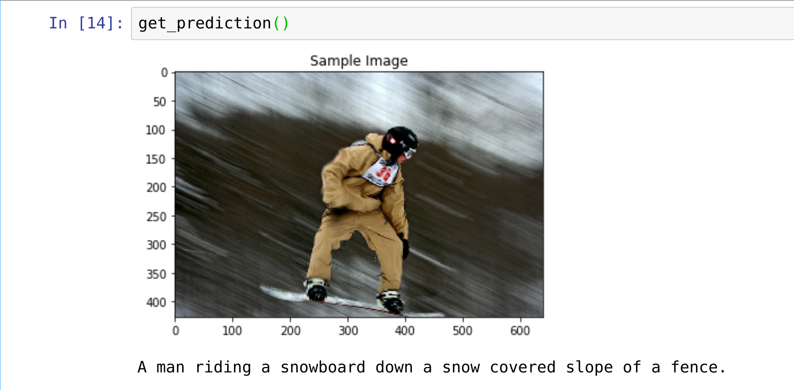

# Education report for image captioning (COCO dataset)

## About the report
This repo is a single README file report, where I'm trying to summarize my experience of educating a neural network for generating captions for COCO dataset.  I've written that report during completing my Udacity course. Neural network is solving a task of generating a caption for a 224 by 224 RGB image.

## About the dataset
[The COCO (Common Objects in Context) dataset](https://cocodataset.org/#home) from 2014 year consists of 414113 color images with captions.

## Results
I've trained a NN during only 3 epochs (each epoch took around 6-7 hours of time). That's definitely not enough and the training process should be extended. But I have limitations in time and can't proceed further with a training process. During 3 epochs I didn't observe any signs of overfitting. Briefly I would say the result isn't something outstanding. Sometimes NN generates absolutely ridiculous captions. But sometimes captions are quite good. Also I've limited a caption length with 20 words maximum.

### Here are some results:

## Neural network architecture
Neural network consist of 2 major parts:
1) Encoder part. Which is a pretrained CNN - [resnet18](https://pytorch.org/vision/main/models/generated/torchvision.models.resnet18.html). For that NN I'm cutting off the last layer and insted of that layer I'm adding a simple linear layer which converts the dimension of the output to `embed_size=512`
2) Decoder part. Consists of an LSTM neural network with an additional [Embedding layer](https://pytorch.org/docs/stable/generated/torch.nn.Embedding.html) 

### Key terms:
1) `vocab_threshold = 5` - we exclude all the words from our vocabulary if they occur less than 5 times in the whole dataset
2) `vocab_size = 8855` - a count of unique words in our vocabulary
3) `hidden_size = 512` - a dimension of the output of our LSTM network
4) `embed_size = 512` - a dimension of the input of our LSTM network. Each word is converted into the vector of that dimension. In the meantime Encoder's output has also this dimension. That's how we can stack together output of the encoder and a word after transformation.

### NN architecture:

As an optimizer I've used [Adam](https://pytorch.org/docs/stable/generated/torch.optim.Adam.html) with a `learning_rate=0.001`

`model.py` - is a pytorch code describing a neural network

### Challenges during this project
1) The biggest challenge for me was to realize that an output of the encoder is becoming an input for decoder only one time for each image. After that we use words as an input with additional usage of embedding layer. It took some time for me to realize that both of these entities have the same dimension `embed_size = 512`.
2) It was hard to understand if my neural network is training or not. Initially I've used a small part of the dataset for training and only for ~ 10 epochs. I've got almost identical version of the sentence for all images. Something like: "A man is a man of a man of a table". Since I didn't have an intuition about that type of problem it was not clear if an architecture is right or not. I was expected to get almost random words for each picture. But that was not the case. After I've increased a dataset volume and spend some time for training, captions became more meaningful.

### Next challenges
1) it make sense to play with a complexity of LSTM. Currently I've used only one layer, but it would be interesting to see the results for 2 layers.
2) I'm curious how an education time would be changing if I'll use different sized of the batch. I've used `batch_size = 128`. It make sense to try 256, 512, 64
3) What would be the difference, if instead of [resnet18](https://pytorch.org/vision/main/models/generated/torchvision.models.resnet18.html), [resnet50](https://pytorch.org/vision/main/models/generated/torchvision.models.resnet50.html) would be used?
4) And of course it would be interesting to train the network longer. I've achieved loss function value 1.95 and I didn't see any signs of overfitting.